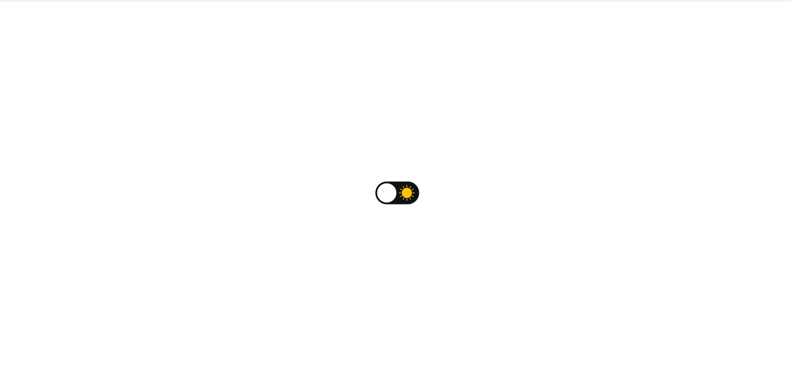

<h1 align="center">Dark Mode Button</h1>

### :mag: Sobre o projeto 
Este projeto contém a implementação de um botão que faz a troca das cores da aplicação entre modo diurno e noturno.

### 🛠️ Tecnologias 

* HTML
* CSS
* JavaScript

### :key: Executar a aplicação

Clone este repositório
$ git clone https://github.com/raissaboeng/dark-mode.git

Acesse a pasta do projeto em seu computador e execute o arquivo index.html no navegador.

Com 💜 por Raissa Boeng

